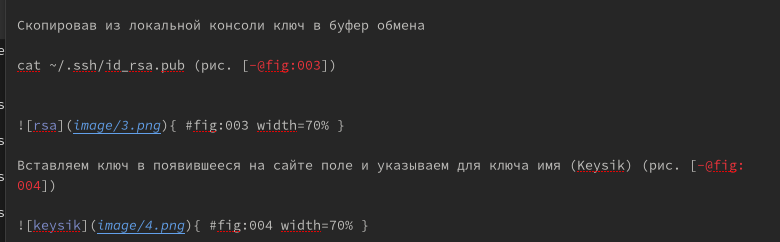
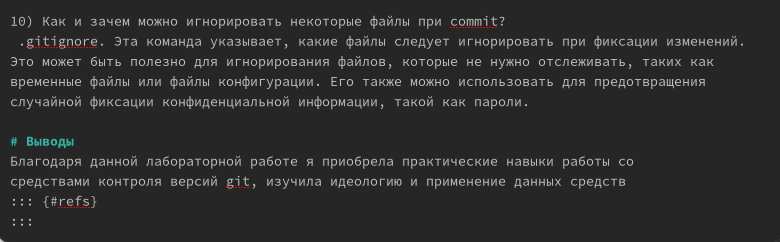

---
## Front matter
lang: ru-RU
title: Презентация по Лабораторной работе №3
subtitle: Markdown
author:
  - Коннова Татьяна Алексеевна
institute:
  - Российский университет дружбы народов, Москва, Россия
date: 25 февраля 2023

## i18n babel
babel-lang: russian
babel-otherlangs: english

## Formatting pdf
toc: false
toc-title: Содержание
slide_level: 2
aspectratio: 169
section-titles: true
theme: metropolis
header-includes:
 - \metroset{progressbar=frametitle,sectionpage=progressbar,numbering=fraction}
 - '\makeatletter'
 - '\beamer@ignorenonframefalse'
 - '\makeatother'
---

# Вступление

## Цель работы

- Научиться оформлять отчёты с помощью легковесного языка разметки Markdown

## Задачи

- Сделать отчёт по предыдущей лабораторной работе в формате Markdown.
- В качестве отчёта предоставить отчёты в 3 форматах: pdf, docx и md (в архиве,
поскольку он должен содержать скриншоты, Makefile и т.д.)

# Ход работы
## Теоретическая часть. Содержание основных элементов отчета
- Титульный лист. Первый лист работы оформляется строго по образцу, который обычно
приводится в методических пособиях по вашему предмету. В нем не просто требуется
указать такие элементы, как название образовательного учреждения, вид работы
и сведения об исполнителе, но и расположить их в строгом соответствии со стандарта-
ми.

- Реферат. Реферат фактически является кратким представлением всего вашего отчета
и содержит ряд статистических сведений. В нем нужно указать количество частей,
страниц работы, иллюстраций, приложений, таблиц, использованных литературных
источников и приложений. Здесь же приводится перечень ключевых слов работы
и собственно текст реферата. Последний подразумевает основные элементы работы
от поставленных целей до результатов и рекомендаций по их внедрению. В практике
вузов в отчеты по лабораторным работам реферат обычно не включают.

- Введение. Во введении типовой лабораторной работы обычно прописывают цели
проводимого исследования и задачи, выполнение которых поможет достичь постав-
ленных целей. В то же время существуют работы, в которых студенты становятся
настоящими первооткрывателями. Приходилось ли вам хотя бы однажды испытывать
чувство крайнего любопытства и нетерпения при проведении лабораторной работы?
Ощущать, что буквально через пару минут вы найдете ответ на вопрос, на который
еще никто и никогда не находил ответа? Именно для таких исследований пишется раз-
вернутое введение с доказательством актуальности и новизны изучаемой темы. Чтобы
действительно провести исследование в той области, в которой, как говорится, еще не
ступала нога человека, во введении вам понадобится привести оценку современного
состояния рассматриваемой проблемы и обосновать необходимость ее решения.

- Основная часть. Так как в разных вузах и в разных дисциплинах существуют свои
тонкости проведения лабораторных работ, содержание основной части подробно
описывают в соответствующих методичках. Важно, чтобы в этом разделе работы была
отражена ее суть, описана методика и результаты проделанной работы.

В основной части прописывают следующие элементы:

- цели проводимого исследования;

- задачи, выполнение которых поможет достичь поставленных целей;

- ход работы, в котором описываются выполненные действия;

- прочие разделы, предусмотренные методическими материалами по изучаемой
дисциплине.

- Заключение. В этой части работы вам потребуется сделать выводы по полученным в хо-
де лабораторной работы результатам. Для этого оцените, насколько полно выполнены
поставленные задачи. В сложных работах могут присутствовать и другие элементы,
например, рекомендации для дальнейшего применения результатов проведённой
работы

## Подготовка вводной части отчёта
Отчет о выполнении лабораторной работы содержит, как правило,
 содержание, заголовки, скриншоты работы с подписями
 
 
 { width=60% }
 
 
## Работа над лабораторной работой №2
 На примере лабораторной работы №2 мы научились создавать формат Markdown
 
  { width=70% }
  
  
## Заключительная часть подготовки отчета на примере лабораторной №2 в формате Markdown

Делаем выводы, перед этим отвечая на вопросы из самостоятельной работы

 { width=70% }
 
## Объединениние трех форматов в один zip-file
 
Делаем архив, содержащий форматы docx, pdf, md посредством сжатия.
 
 
 
 
 { width=25% }
 
 
# Подведение итогов

В следующем разделе мы должны прописать выводы из проделанной работы:

## Вывод:
- Научились оформлять отчёты с помощью легковесного языка разметки Markdownл 

# 

Спасибо за внимание!
