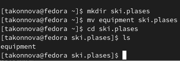
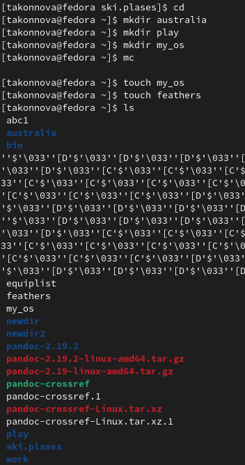
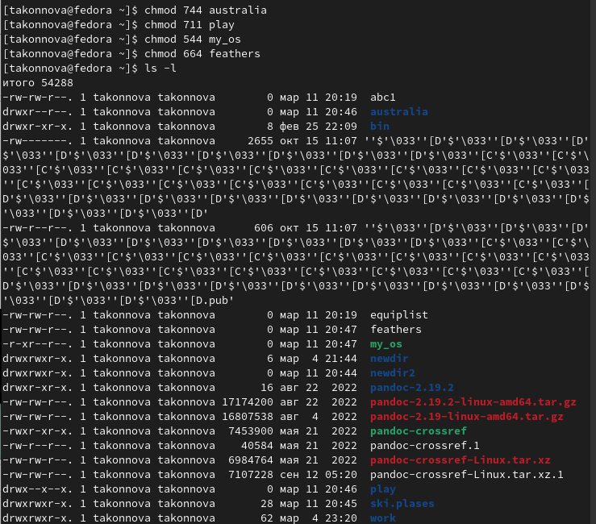
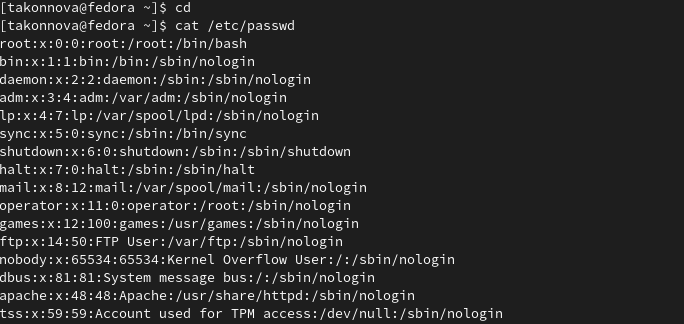
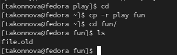
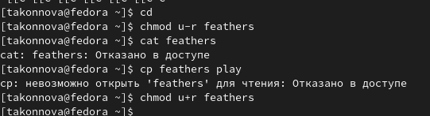
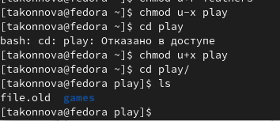
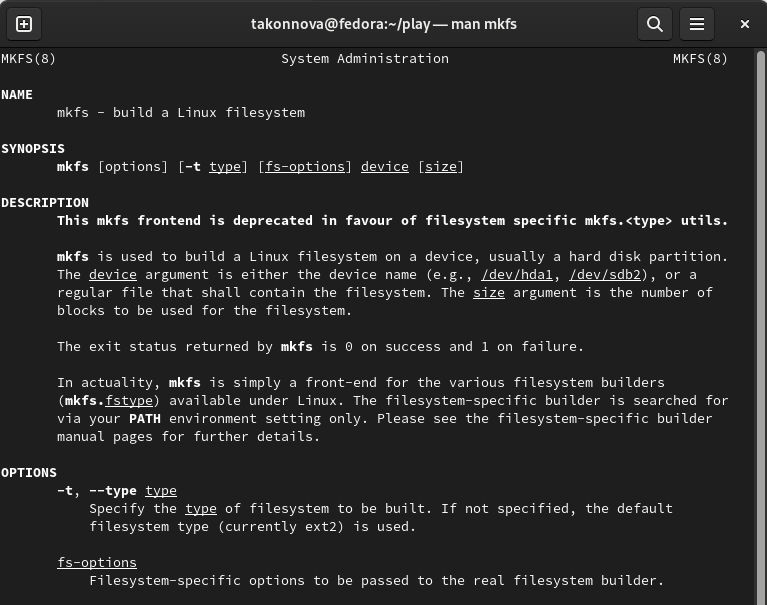

---
## Front matter
lang: ru-RU
title: Лабораторная работа №5.
author: |
	Коннова Татьяна Алексеевна
institute: |
	RUDN, Москва, Россия
date: 2023, 11 марта

## Formatting
toc: false
slide_level: 2
theme: metropolis
header-includes: 
 - \metroset{progressbar=frametitle,sectionpage=progressbar,numbering=fraction}
 - '\makeatletter'
 - '\beamer@ignorenonframefalse'
 - '\makeatother'
aspectratio: 43
section-titles: true
---

# Анализ файловой системы Linux. Команды для работы с файлами и каталогами.

## Копирование файла и изменение его названия

1. cp - команда для копирования файлов или каталогов.
2. ls - команда для просмотра содержимого каталогов.

{ #fig:001 width=70% }

## Создание директории

mkdir - команда для создания директорий.

{ #fig:002 width=100% }

## Перемещение файла

mv - команда для перемещения или изменения названия файлов или каталогов.

{ #fig:003 width=100% }

## Изменение названия файла

{ #fig:004 width=100% }

## Создание, копирование и изменение названия файла

touch - команда для создания файлов.

{ #fig:005 width=100% }

## Создание каталога

{ #fig:006 width=100% }

## Перемещение файлов в подкаталог

{ #fig:007 width=100% }

## Создание, копирование и изменение названия каталога
	
{ #fig:008 width=100% }

## Создание 2 каталогов и 2 файлов

{ #fig:009 width=100% }

## Присвоение определённых прав доступа

Присвоим каждому из каталогов и файлов определённые права доступа. 

{ #fig:010 width=70% }

## Просмотр содержимого файла

cat - команда для просмотра содержимого файла. 

{ #fig:011 width=70% }

## Копирование файла

{ #fig:012 width=100% }

## Перемещение файла

{ #fig:013 width=100% }

## Копирование каталога

{ #fig:014 width=100% }

## Перемещение и изменение названия каталога

{ #fig:015 width=100% }

## Работа с правами файла

chmod u-r - команда для лишения владельца файла права на чтение.

chmod u+r - команда для присвоения владельцу файла права на чтение.

{ #fig:016 width=100% }

## Работа с правами каталога

chmod u-x - команда для лишения владельца каталога права на выполнение.

chmod u+x - команда для присвоения владельцу каталога права на выполнение.

{ #fig:017 width=100% }

# Прочитаем с помощью команды man следующие команды: mount, fsck, mkfs, kill. Кратко охарактеризуем эти команды.

## mount

Для просмотра используемых в операционной системе файловых систем используется команда mount.

{ #fig:018 width=60% }

## fsck

С помощью команды fsck можно проверить (а в ряде случаев восстановить) целостность файловой системы.

{ #fig:019 width=70% }

## mkfs

mkfs используется для создания файловой системы Linux на некотором устройстве, обычно в разделе жёсткого диска. В качестве аргумента filesys для файловой системы может выступать или название устройства (например, /dev/hda1, /dev/sdb2) или точка монтирования (например, /, /usr, /home).

{ #fig:020 width=60% }

## kill

Утилита kill отправляет сигнал процессу(-ам), указанному с помощью каждого из операндов идентификатор_процесса. По умолчанию утилита kill отправляет сигнал SIGTERM, но эту настройку по умолчанию можно переопределить путем определения имени сигнала для отправки.

{ #fig:021 width=60% }

# Выводы

В ходе выполнения лабораторной работы мы ознакомились с файловой системой Linux, её структурой, именами и содержанием каталогов. Приобрели практические навыки по применению команд для работы с файлами и каталогами, по управлению процессами (и работами), по проверке использования диска и обслуживанию файловой системы.

## {.standout}

Спасибо за внимание!
