---
## Front matter
lang: ru-RU
title: Лабораторная работа № 6.
author: |
	Коннова Татьяна Алексеевна
institute: |
	RUDN, Москва, Россия
date: 2023, 18 марта

## Formatting
toc: false
slide_level: 2
theme: metropolis
header-includes: 
 - \metroset{progressbar=frametitle,sectionpage=progressbar,numbering=fraction}
 - '\makeatletter'
 - '\beamer@ignorenonframefalse'
 - '\makeatother'
aspectratio: 43
section-titles: true
---

# Поиск файлов. Перенаправление ввода-вывода. Просмотр запущенных процессов.

## Приобретение навыков по записи информации в файл

1. Используя команду ls -a /etc > file.txt, запишем файлы из каталога /etc.
2. Используя команду ls -a ~ >> file.txt, допишем файлы из домашнего каталога.
3. Командой cat выполним проверку.

## Запись файлов с нужным разширением

Для записи файлов с нужным разширением воспользуемся командой:

grep -e '\.conf$' file.txt > conf.txt

## Поиск определённых файлов 

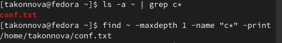{ #fig:003 width=100% }

## Вывод на экран нужных файлов

Команда для вывода на экран имён файлов из каталога /etc, начинающихся с символа h.

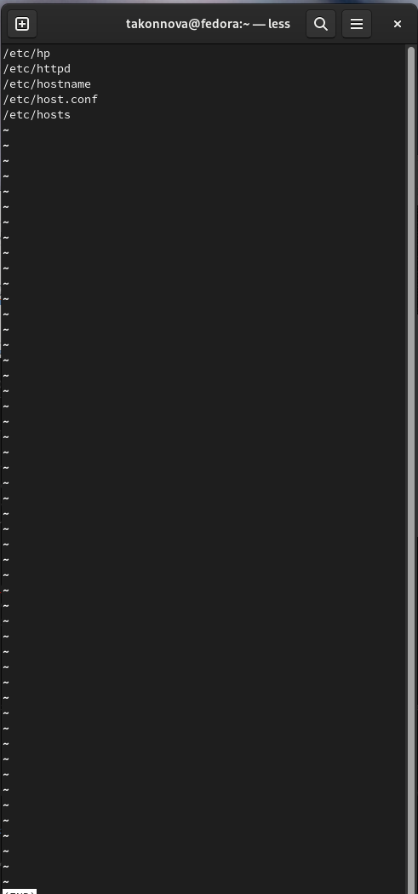{ #fig:004 width=100% }

## Запуск фонового процесса по записи

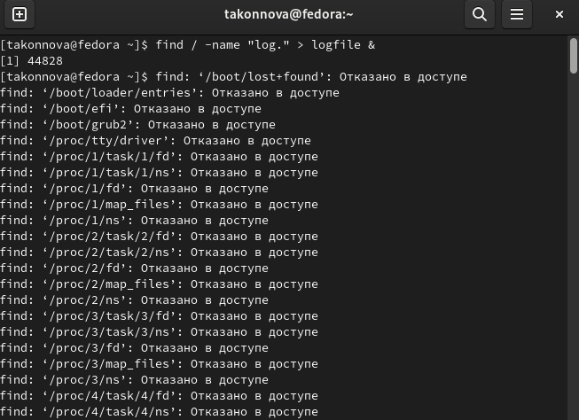{ #fig:006 width=70% }

## Удаление файла
	
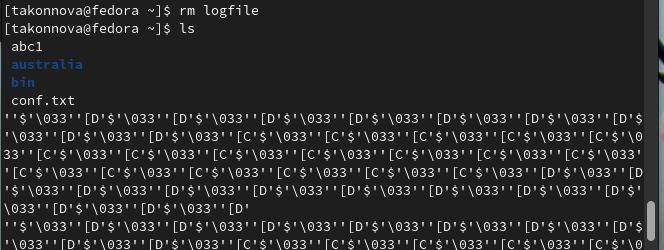{ #fig:008 width=100% }

## Фоновый запуск редактора

Запустим из консоли в фоновом режиме редактор gedit.

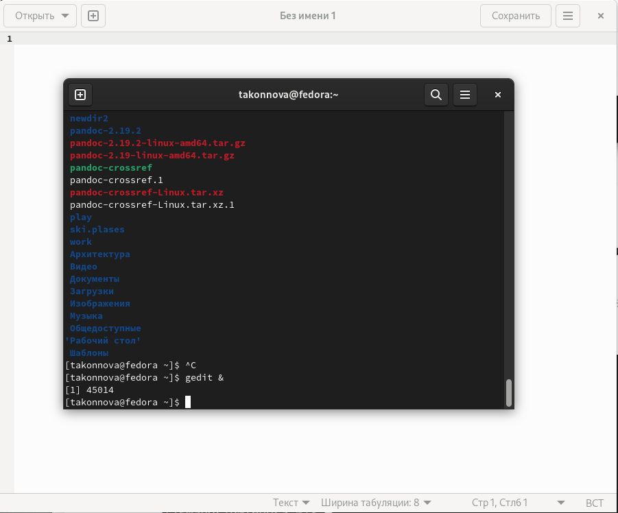{ #fig:009 width=100% }

## Определение индетификатора процесса gedit

Определим идентификатор процесса gedit, используя команду ps, конвейер и фильтр grep.

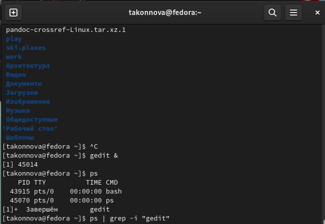{ #fig:010 width=100% }

## Справка команды kill

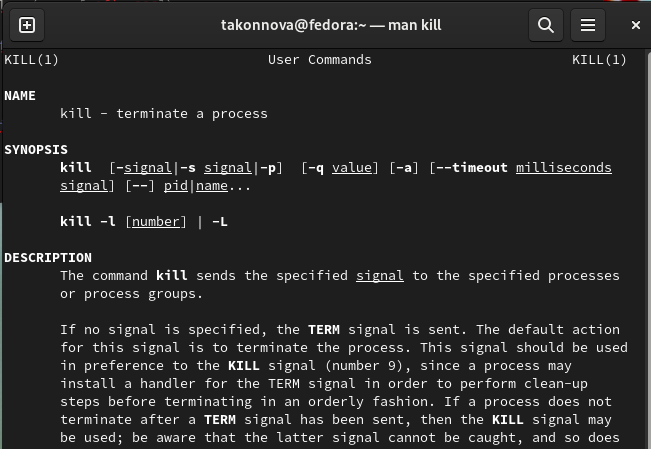{ #fig:011 width=70% }

## Использование команды kill для gedit
    	
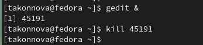{ #fig:012 width=100% }

## Справка команды df

Команда df показывает размер каждого смонтированного раздела диска.

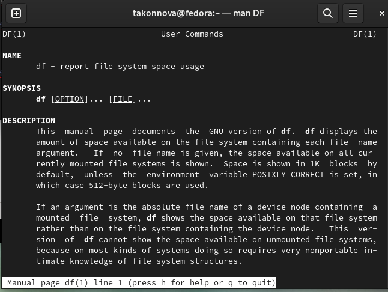{ #fig:013 width=90% }

## Справка команды du

Команда du показывает число килобайт, используемое каждым файлом или каталогом.

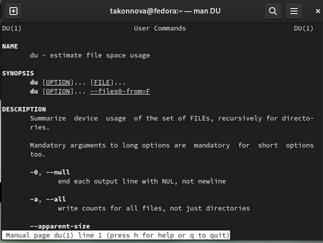{ #fig:014 width=80% }

## Выполнение команд df и du

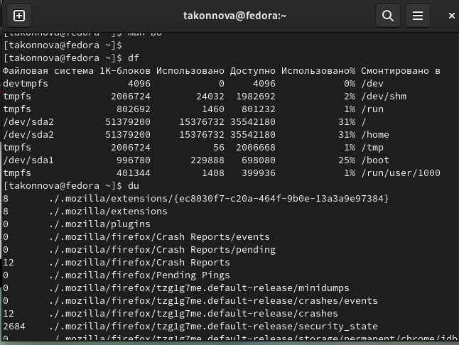{ #fig:015 width=100% }

## Справка команды find

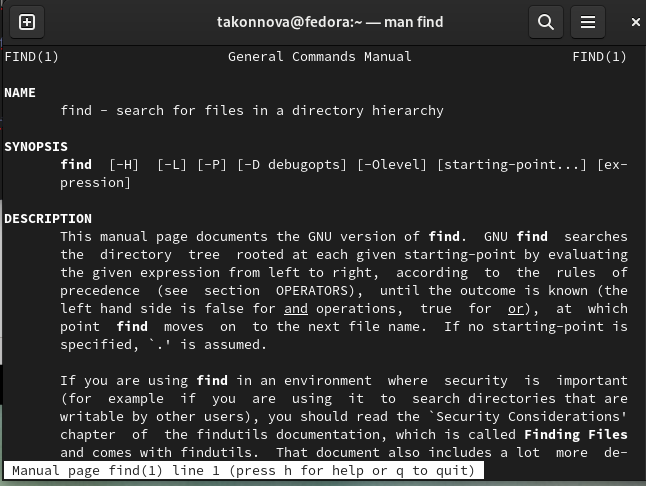{ #fig:016 width=100% }

## Вывод имён всех директорий в домашнем каталоге

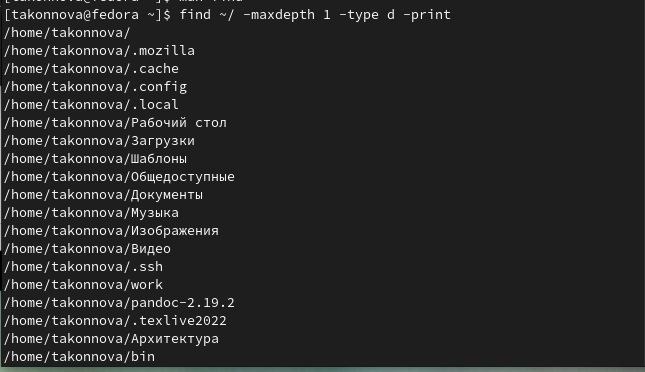{ #fig:017 width=70% }

# Выводы

В ходе выполнения лабораторной работы мы ознакомились с инструментами поиска файлов и фильтрации текстовых данных. Приобрели практические навыки: по управлению процессами (и заданиями), по проверке использования диска и обслуживанию файловых систем.

## {.standout}

Спасибо за внимание!
