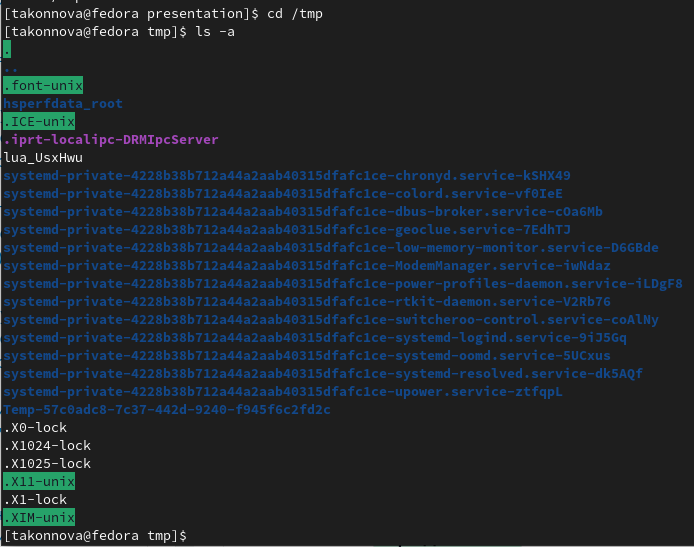
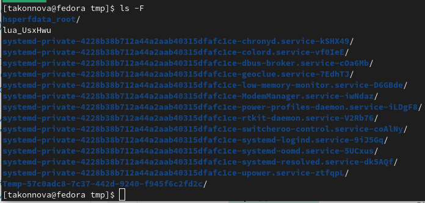
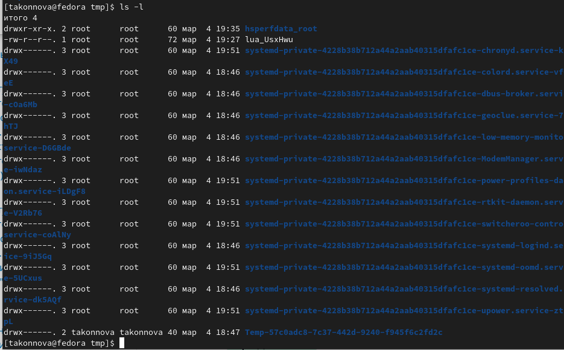
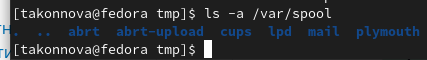
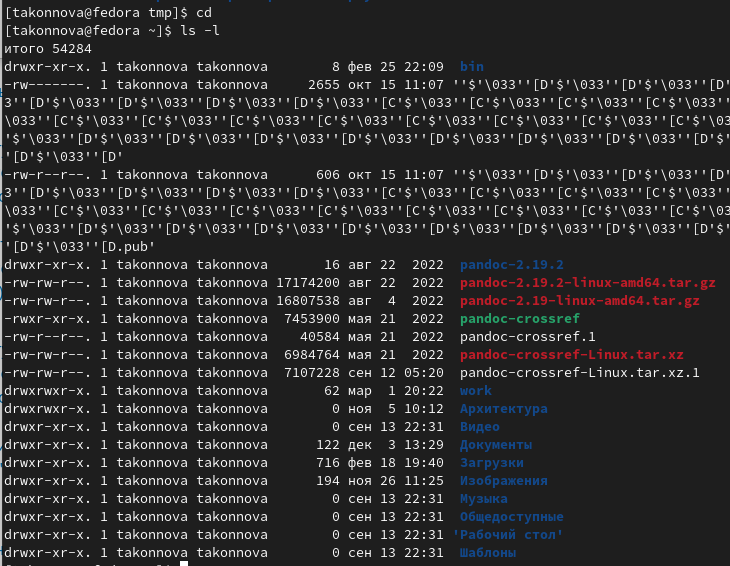
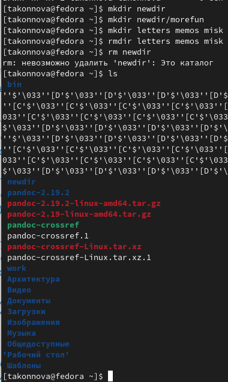
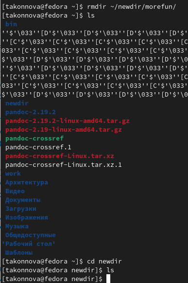
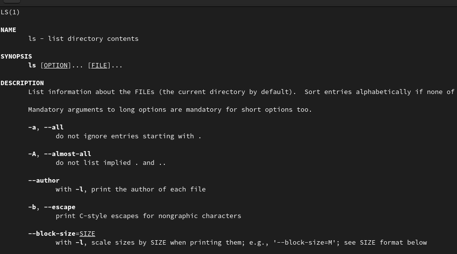
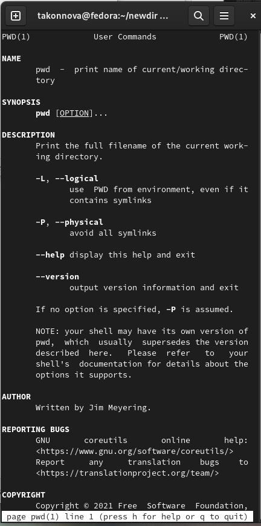
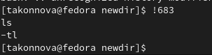

---
## Front matter
title: "Лабораторная работа №4. Основы интерфейса взаимодействия пользователя с системой Unix на уровне командной строки."
subtitle: "НПИбд-01-22"
author: "Коннова Татьяна Алексеевна"

## Generic otions
lang: ru-RU
toc-title: "Содержание"

## Bibliography
bibliography: bib/cite.bib
csl: pandoc/csl/gost-r-7-0-5-2008-numeric.csl

## Pdf output format
toc: true # Table of contents
toc-depth: 2
lof: true # List of figures
lot: true # List of tables
fontsize: 12pt
linestretch: 1.5
papersize: a4
documentclass: scrreprt
## I18n polyglossia
polyglossia-lang:
  name: russian
  options:
	- spelling=modern
	- babelshorthands=true
polyglossia-otherlangs:
  name: english
## I18n babel
babel-lang: russian
babel-otherlangs: english
## Fonts
mainfont: PT Serif
romanfont: PT Serif
sansfont: PT Sans
monofont: PT Mono
mainfontoptions: Ligatures=TeX
romanfontoptions: Ligatures=TeX
sansfontoptions: Ligatures=TeX,Scale=MatchLowercase
monofontoptions: Scale=MatchLowercase,Scale=0.9
## Biblatex
biblatex: true
biblio-style: "gost-numeric"
biblatexoptions:
  - parentracker=true
  - backend=biber
  - hyperref=auto
  - language=auto
  - autolang=other*
  - citestyle=gost-numeric
## Pandoc-crossref LaTeX customization
figureTitle: "Рис."
tableTitle: "Таблица"
listingTitle: "Листинг"
lofTitle: "Список иллюстраций"
lolTitle: "Листинги"
## Misc options
indent: true
header-includes:
  - \usepackage{indentfirst}
  - \usepackage{float} # keep figures where there are in the text
  - \floatplacement{figure}{H} # keep figures where there are in the text
---

# Цель работы
Приобрести практические навыки взаимодействия пользователя с системой посредством командной строки.

# Выполнение лабораторной работы
Определим полное имя домашнего каталога. Далее относительно этого каталога будут выполняться последующие упражнения.

Переходим в папку /tmp.

 
Выведем в терминал содержимое папки /tmp. Для этого используем команду ls с разными ключами.

Используя ключ –a, мы выводим на экран все каталоги и файлы, даже не видимые нам. (рис. [-@fig:001]) 

{ #fig:001 width=70% }

Применяя аргумент –F, выводится информация о типах файлов и папок.(рис. [-@fig:002]) 

{ #fig:002 width=70% }

Используя аргумент –l, мы выводим на экран подробную информацию файле(паке):(имя файла или каталога тип файла, размер, дата последней ревизии, право доступа, число ссылок, юзер).(рис. [-@fig:003]) 

{ #fig:003 width=70% }

Выясним, есть ли в каталоге /var/spool папка с именем cron?
Для этого переходим в
домашний каталог и выведем на экран его содержимое. (рис. [-@fig:004]) 

{ #fig:004 width=70% }

Для этого переходим в домашний каталог и выведем на экран его содержимое. Определим также, кто является владельцем файлов и папок(takonnova).(рис. [-@fig:005]) 

{ #fig:005 width=70% }

#3
В домашнем каталоге создаем каталог с именем newdir.(рис. [-@fig:006]) 

В каталоге ~/newdir создаем каталог с именем morefun.(рис. [-@fig:006]) 

 В домашнем каталоге создадим одной командой три новых каталога с именами letters, memos, misk. Затем удаляем эти каталоги одной командой.(рис. [-@fig:006]) 
 
 Попробуем удалить ранее созданный каталог ~/newdir командой rm. Проверим, был ли папка удалёна.
(рис. [-@fig:006]) 

{ #fig:006 width=70% }
 

Удалим каталог ~/newdir/morefun из домашнего каталога. Проверим, была ли папка удалена.(рис. [-@fig:007]) 

{ #fig:007 width=70% }

    С помощью команды man определим, какую опцию команды ls нужно использовать для просмотра содержимого не только данной папки, но и подпапок, входящих в нее.
Написав команду man cd просмотриm команды и их назначение
(рис. [-@fig:008]) 

{ #fig:008 width=70% }

С помощью команды man ls определим набор опций команды ls, позволяющий отсортировать по времени последнего изменения выводимый список содержимого каталога с развёрнутым описанием файлов.
(рис. [-@fig:011]) 

{ #fig:011 width=70% }

    Используем команду man для просмотра описания следующих команд: cd, pwd, mkdir, rmdir, rm. Поясним их основные опции.

Опциями команды cd являются аргументы –L и –P. -P – позволяет следовать по символическим ссылкам перед обработкой все переходы ".."; -L – переходит по символическим ссылкам только после того, как были обработаны ".."; -e – если каталог, в который нужно перейти не удалось найти – показывает формат ошибки.

Опциями команды pwd являются аргументы 
–L, --logical, –P, --help, --version. 

-L - брать директорию из переменной окружения
-P - отбрасывать все символические ссылки; 
--help - отобразить справку по утилите; 
--version - отобразить ее версию.
(рис. [-@fig:010]) 

{ #fig:010 width=70% }

Ключами команды mkdir являются 
–m, --mode=MODE, 
–p, --parents, 
-v, --verbose, 
-Z, --context, 
--help, --version. 
-m( права для создаваемой директории 
-p или –parents – создать все директории, которые указаны внутри пути (если какая-либо директория существует, то предупреждение об этом не выводится); -v или –verbose – выводить сообщение о каждой создаваемой директории; -Z – установить контекст SELinux для создаваемой директории по умолчанию; --context – установить контекст SELinux для создаваемой директории в значение CTX; --help – оказать справку по команде mkdir; --version – показать версию утилиты mkdir.

Ключами команды rmdir являются аргументы 

–ignore-fail-on-non-empty, 
-p, --parents, 
-v, 
--verbose, 
--help, --version. –ignore-fail-on-non-empty – игнорировать ошибки, вызванные тем, что директория не пустая; 
-p, --parents – удалить директорию и все её дочерние элементы; 
-v, --verbose – выводить диагностику для каждой обработанной директории; 
--help – оказать справку по команде rmdir; --version – показать версию утилиты rmdir.

Ключами команды rm являются аргументы 
-r, 
-R, 
--recursive, 
-d, --dir, 
–f,
--force, -I, 
-I, --interactivе, 
--one-file-system, 
--no-preserve-root, 
--preserve-root, 
-v, --verbose, 
--help, --version. 
--one-file-system - во время рекурсивного удаления пропускать директории, которые находятся на других файловых системах; --no-preserve-root - если в качестве директории для удаления задан корневой раздел /, то считать, что это обычная директория и начать выполнять удаление; --preserve-root - если в качестве директории для удаления задан корневой раздел /, то запретить выполнять команду rm над корневым разделом (данное поведение используется по умолчанию); 
-r, -R или --recursive - удаление директорий и их содержимого (рекурсивное удаление); 
-d или --dir - удалять пустые директории; 
-v или --verbose - выводить информацию об удаляемых файлах, 
-f или --force - игнорировать несуществующие файлы и аргументы, никогда не выдавать запросы на подтверждение удаления; 
-i - выводить запрос на подтверждение удаления каждого файла; 
-I - выдать один запрос на подтверждение удаления всех файлов, если удаляется больше трех файлов или используется рекурсивное удаление; --interactive - вместо WHEN можно использовать: never — никогда не выдавать запросы на подтверждение удаления, once — выводить запрос один раз (аналог опции -I), 
always (по умолчанию) — выводить запрос всегда (аналог опции -i); 

Используя информацию, полученную при помощи команды history, выполним модификацию и исполнение нескольких команд из буфера команд.

(рис. [-@fig:012]) 

{ #fig:012 width=90% }

Контрольные вопросы

    Что такое командная строка?

Способ взаимодействия между человеком и компьютером путём отправки компьютеру команд, представляющих собой последовательность символов. Команды интерпретируются с помощью специального интерпретатора, называемого оболочкой.

    При помощи какой команды можно определить абсолютный путь текущего каталога? Приведите пример.

С помощью команды pwd.

    При помощи какой команды и каких опций можно определить только тип файлов и их имена в текущем каталоге? Приведите примеры.

С помощью команды ls с аргументом -F.

    Каким образом отобразить информацию о скрытых файлах? Приведите примеры.

С помощью команды ls с аргументом -a.

    При помощи каких команд можно удалить файл и каталог? Можно ли это сделать одной и той же командой? Приведите примеры.

Файл можно удалить с помощью команды rm. Для удаления непустого каталога используется команда rm с аргументом -r. Для удаления пустого каталога используется команда rmdir.

    Каким образом можно вывести информацию о последних выполненных пользователем командах?

С помощью команды history.

    Как воспользоваться историей команд для их модифицированного выполнения? Приведите примеры.

Для модификации команды из истории используется следующая схема: !<номер команды>:s/<то, что меняем>/<то, на что меняем>.

    Приведите примеры запуска нескольких команд в одной строке.

    Дайте определение и приведите примеры символов экранирования. Символ экранирования – это символ, который вызывает альтернативную интерпретацию следующих символов в последовательности символов. Этим символом в командной строке является обратный слэш. Примеры:  \/

    Охарактеризуйте вывод информации на экран после выполнения команды ls с опцией l.

При выполнении команды ls -l на экран выводится следующая информация о файлах и директориях:

    Тип файла
    Права доступа
    Число ссылок
    Владелец
    Размер
    Дата последней ревизии
    Имя файла или каталога

    Что такое относительный путь к файлу? Приведите примеры использования относительного и абсолютного пути при выполнении какой-либо команды.

Относительный путь к файлу – это путь, начинающийся от текущей директории.

    Как получить информацию об интересующей вас команде?

С помощью команды man.

    Какая клавиша или комбинация клавиш служит для автоматического дополнения вводимых команд?

Клавиша Tab.
# Выводы
Приобрели практические навыки взаимодействия пользователя с системой посредством командной строки.

::: {#refs}
:::
