---
## Front matter
lang: ru-RU
title: Лабораторная работа № 10.
author: |
	Коннова Татьяна Алексеевна
institute: |
	RUDN, Москва, Россия
date: 2023

## Formatting
toc: false
slide_level: 2
theme: metropolis
header-includes: 
 - \metroset{progressbar=frametitle,sectionpage=progressbar,numbering=fraction}
 - '\makeatletter'
 - '\beamer@ignorenonframefalse'
 - '\makeatother'
aspectratio: 43
section-titles: true
---

# Программирование в командном процессоре ОС UNIX. Командные файлы

## Создание нового каталога и файла для скрипта

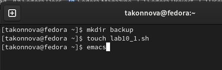{ #fig:001 width=100% }

## Первый скрипт

Напишем скрипт, который при запуске будет делать резервную копию самого себя (то есть файла, в котором содержится его исходный код) в другую директорию backup
в домашнем каталоге. При этом файл должен архивироваться одним из архиваторов на выбор zip, bzip2 или tar. 

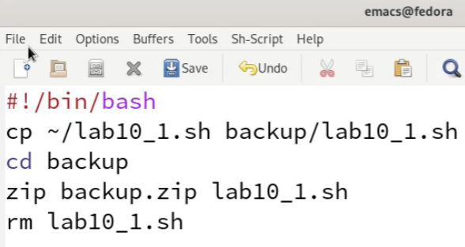{ #fig:002 width=50% }

## Право на выполнение, запуск файла и проверка

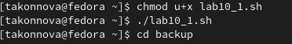{ #fig:003 width=100% }

## Создание второго файла и открытие emacs

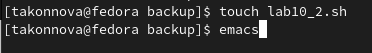{ #fig:004 width=100% }

## Второй скрипт

Начинаем писать пример командного файла, обрабатывающего любое произвольное число аргументов командной строки, в том числе превышающее десять. Скрипт может последовательно распечатывать значения всех переданных аргументов.

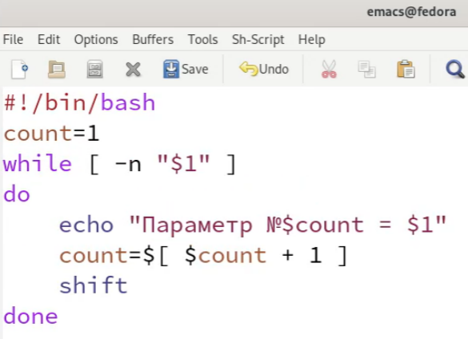{ #fig:005 width=50% }

## Право на выполнение, запуск файла

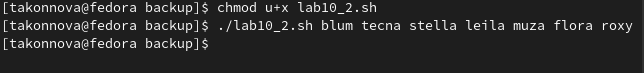{ #fig:006 width=100% }

## Создание третьего файла

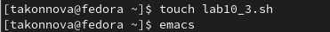{ #fig:007 width=100% }

## Третий скрипт

Напишем командный файл — аналог команды ls (без использования самой этой команды и команды dir). В котором требуется, чтобы он выдавал информацию о нужном каталоге и выводил информацию о возможностях доступа к файлам этого каталога.
	
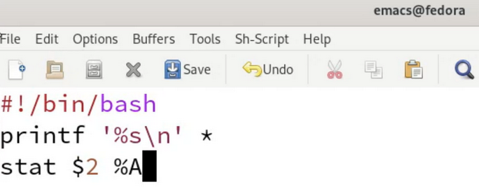{ #fig:008 width=85% }

## Право на выполнение, запуск файла для каталога backup

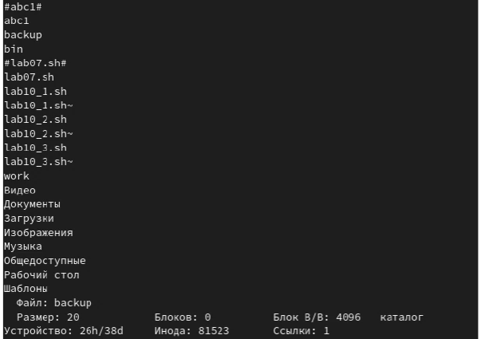{ #fig:009 width=50% }

## Создание четвёртого файла

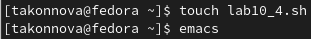{ #fig:010 width=100% }

## Четвёртый скрипт

Напишем командный файл, который получает в качестве аргумента командной строки формат файла (.txt, .doc, .jpg, .pdf и т.д.) и вычисляет количество таких файлов в указанной директории. Путь к директории также передаётся в виде аргумента командной строки. 

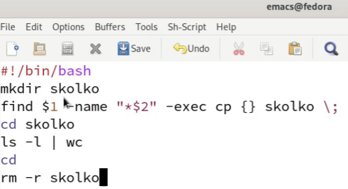{ #fig:011 width=60% }

## Право на выполнение, запуск файла для форматов .txt и .pdf

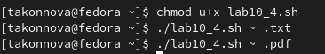{ #fig:012 width=70% }

# Выводы

В ходе выполнения лабораторной работы мы изучили основы программирования в оболочке ОС UNIX/Linux и научились писать небольшие командные файлы.

## {.standout}

Спасибо за внимание!
