---
## Front matter
lang: ru-RU
title: Лабораторная работа № 11.
author: |
	Коннова Татьяна Алексеевна
institute: |
	RUDN, Москва, Россия
date: 2023

## Formatting
toc: false
slide_level: 2
theme: metropolis
header-includes: 
 - \metroset{progressbar=frametitle,sectionpage=progressbar,numbering=fraction}
 - '\makeatletter'
 - '\beamer@ignorenonframefalse'
 - '\makeatother'
aspectratio: 43
section-titles: true
---

# Программирование в командном процессоре ОС UNIX. Ветвления и циклы.

## Создание первого файла для скрипта

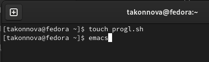{ #fig:001 width=100% }

## Написание первого скрипта

Написать скрипт, который анализирует командную строку с определёнными ключами, а затем ищет в указанном файле нужные строки, определяемые ключом -p.

## Написание первого скрипта

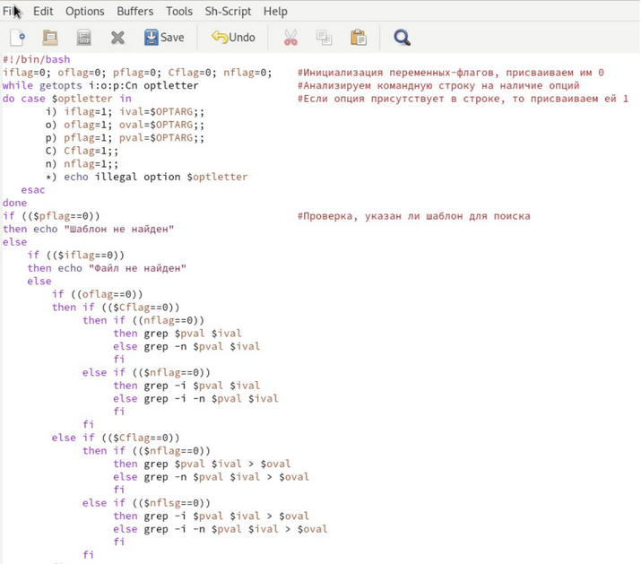{ #fig:002 width=70% }

## Запуск и проверка выполнения первого скрипта

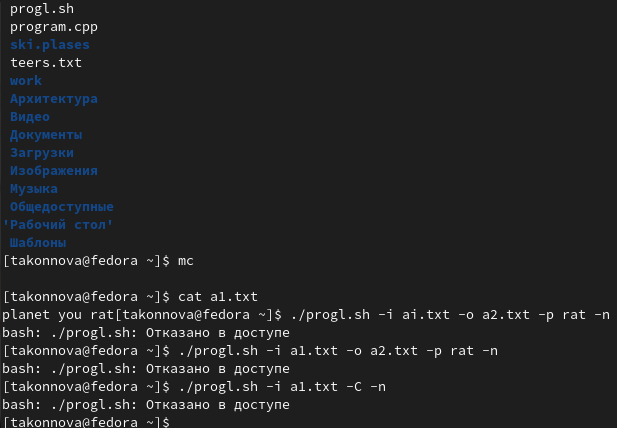{ #fig:003 width=80% }

## Создание файлов для второго задания 

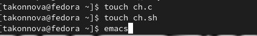{ #fig:004 width=100% }

## Написание программы на языке программирования Си

Написать на языке Си программу, которая вводит число и определяет, является ли оно больше нуля, меньше нуля или равно нулю. Затем программа завершается с помощью функции exit(n), передавая информацию в о коде завершения в оболочку.

## Написание программы на языке программирования Си

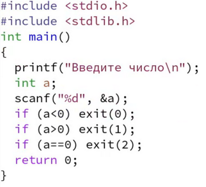{ #fig:005 width=200 }

## Написание скрипта для второго задания

Написать командный файл, который должен вызывать эту программу и, проанализировав с помощью команды $?, выдать сообщение о том, какое число было введено.

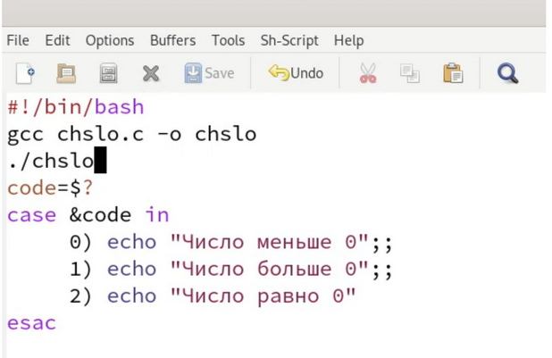{ #fig:006 width=60% }

## Право на выполнение и последующая проверка

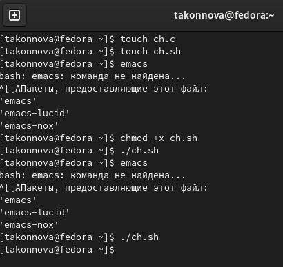{ #fig:007 width=75% }

## Создание файла для третьего задания

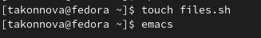{ #fig:008 width=100% }

## Написание третьего скрипта

Написать командный файл, создающий указанное число файлов, пронумерованных последовательно от 1 до N (например 1.tmp, 2.tmp, 3.tmp,4.tmp и т.д.). Число файлов, которые необходимо создать, передаётся в аргументы командной строки. Этот же командный файл должен уметь удалять все созданные им файлы (если они существуют).

## Написание третьего скрипта
	
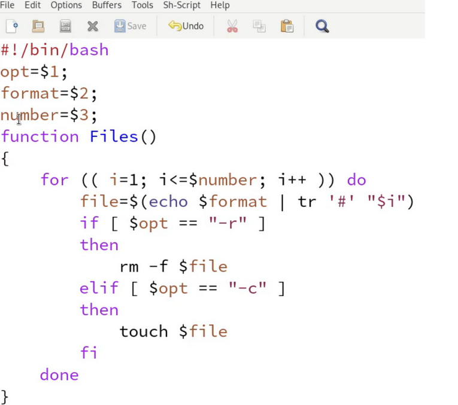{ #fig:009 width=70% }

## Право на выполнение и запуск файла

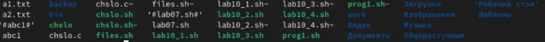{ #fig:010 width=100% }

## Создание файла для четвёртого задания

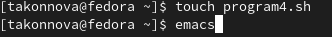{ #fig:011 width=100% }

## Написание четвёртого скрипта

Написать командный файл, который с помощью команды tar запаковывает в архив все файлы в указанной директории. Модифицировать его так, чтобы запаковывались только те файлы, которые были изменены менее недели тому назад (использовать команду find).

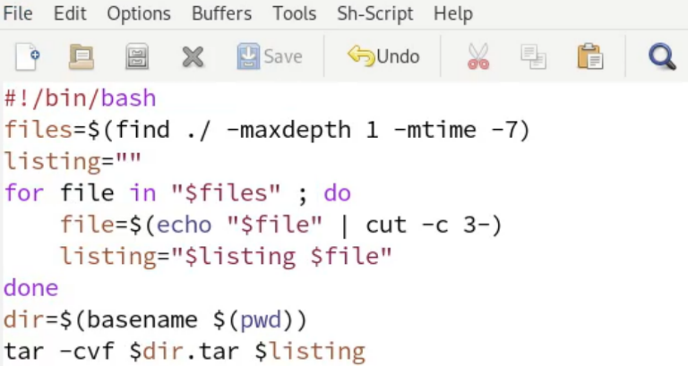{ #fig:012 width=65% }

## Право на выполнение и запуск файла для нужного каталога

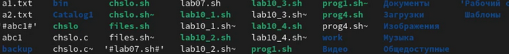{ #fig:013 width=85% }

## Проверка

{ #fig:014 width=100% }

# Выводы

В ходе выполнения лабораторной работы мы изучили основы программирования в оболочке ОС UNIX и научились писать более сложные командные файлы с использованием логических управляющих конструкций и циклов.

## {.standout}

Спасибо за внимание!
