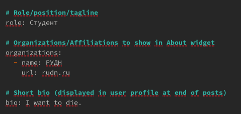
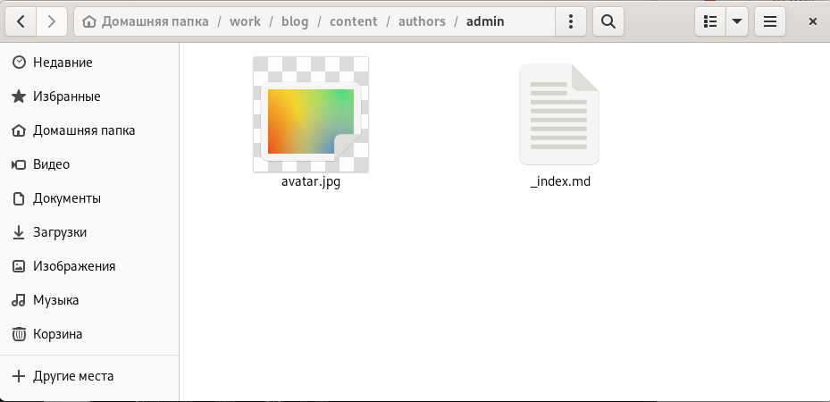
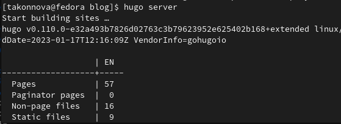
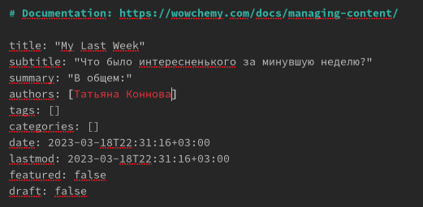
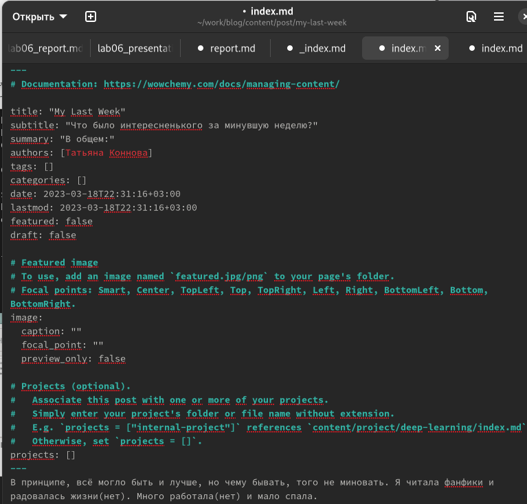
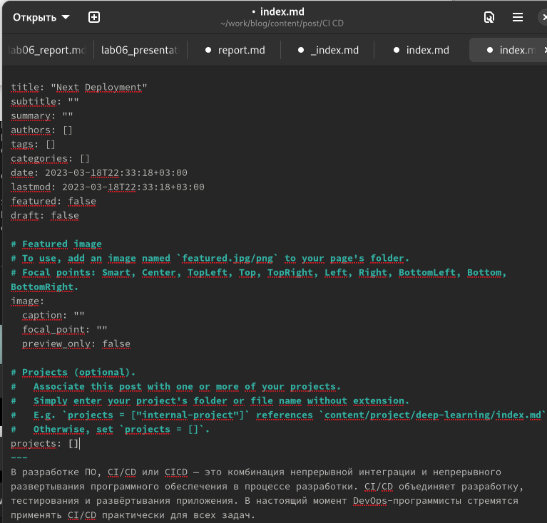
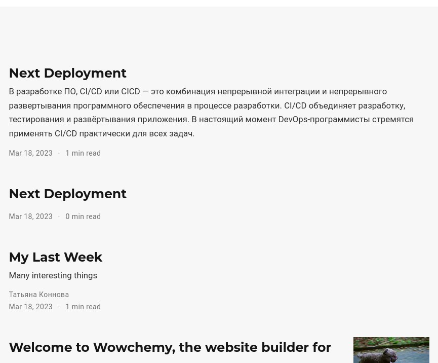
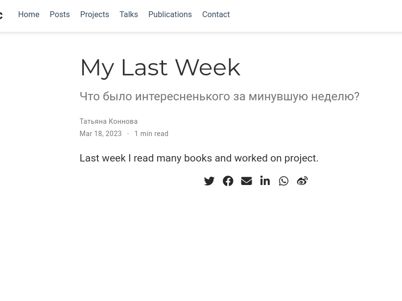
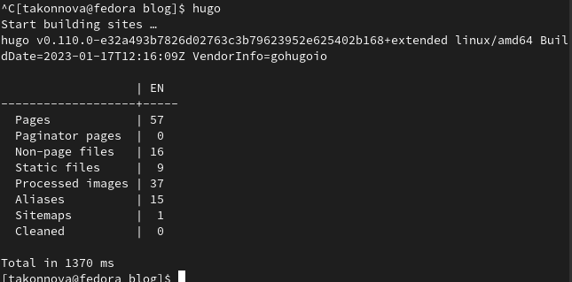

---
## Front matter
lang: ru-RU
title: Индивидуальный проект
subtitle: Этап 2
author:
  - Коннова Татьяна Алексеевна
institute:
  - Российский университет дружбы народов, Москва, Россия
date: 18 марта 2023

## i18n babel
babel-lang: russian
babel-otherlangs: english

## Formatting pdf
toc: false
toc-title: Содержание
slide_level: 2
aspectratio: 169
section-titles: true
theme: metropolis
header-includes:
 - \metroset{progressbar=frametitle,sectionpage=progressbar,numbering=fraction}
 - '\makeatletter'
 - '\beamer@ignorenonframefalse'
 - '\makeatother'
---

# Вступление

## Цель работы

Добавить к сайту данные о себе.

## Задание

- Список добавляемых данных
    - Разместить фотографию владельца сайта
    - Разместить краткое описание владельца сайта (Biography)
    - Добавить информацию об интересах (Interests)
    - Добавить информацию об образовании (Education)
- Сделать пост по прошедшей неделе
- Добавить пост на тему по выбору:
    - Управление версиями Git
    - Непрерывная интеграция и непрерывное развертывание (CI/CD)

# Выполнение этапа 2

## Описание владельца сайта

Добавим данные о себе. Для этого откроем файл _index.md в каталоге ~/work/blog/content/authors/admin.

Укажем краткое описание владельца сайта.

{ width=45% }

## Фото профиля и интересы

Добавим фото профиля.

{ width=30% }

Добавим информацию об интересах.

{ width=25% }

## Образование

Добавим информацию об образовании.

{ width=35% }

## Создание постов

Теперь создадим два новых поста.

{ width=40% }

{ width=40% }

## Заполнение постов

Запустим локальный сервер для просмотра вносимых на сайт изменений.

{ width=25% }

После того, как мы создали посты, заполним их. Укажем заголовок, подзаголовок, краткую сводку, автора.

{ width=30% }

## Заполнение постов

И укажем сам текст статьи.

{ width=40% }

{ width=40% }

## Просмотр постов

Мы можем увидеть результат своих действий.

{ width=30% }

{ width=30% }

## Просмотр постов

{ width=30% }

## Сборка сайта и загрузка на GitHub

Теперь соберём сайт с помощью команды hugo.

{ width=30% }

Добавим все изменения на GitHub. Для этого перейдйм в каталог blog, введём команды git add .; git commit –am “feat(main): blog updated”; git push, и после них перейдём в каталог blog/public/ и повторим команды: git add .; git commit –am “feat(main): public updated”; git push.

# Заключение

Были внесены изменения на сайте – добавлена информация о владельце и два новых поста.

